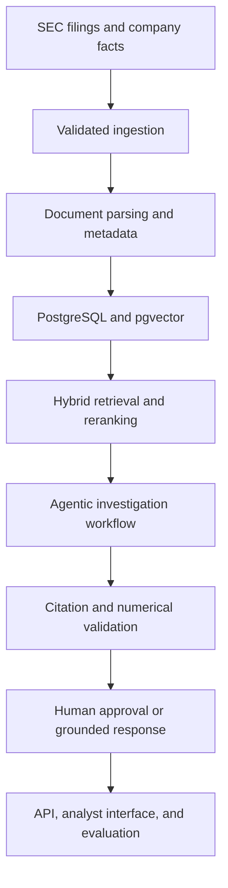

# FinSight AI

**Agentic financial-risk intelligence grounded in public SEC filings.**

FinSight AI is a production-oriented AI engineering project designed to help analysts investigate company risks, financial trends, and regulatory disclosures using evidence-backed answers.

The planned platform combines SEC document ingestion, hybrid retrieval, grounded generation, numerical validation, agent orchestration, human approval controls, evaluation, observability, and cloud deployment.

> FinSight AI is an independent educational project. It does not provide investment, legal, accounting, or financial advice.

## Project status

**Current milestone: Hybrid retrieval and citation-ready evidence**

Implemented:

- Typed FastAPI application with health-check endpoint
- Environment-based configuration using Pydantic Settings
- Async SQLAlchemy runtime for PostgreSQL 17
- Alembic-managed SEC filing storage schema
- pgvector, PostgreSQL full-text search, and trigram-search support
- Company, filing, section, and retrieval-ready chunk models
- Policy-compliant SEC EDGAR submissions and filing-document client
- Identifiable SEC user agent, configurable request pacing, bounded retries, and `Retry-After` handling
- Typed SEC response validation and normalized CIK handling
- SHA-256 document integrity and source-provenance metadata
- Transaction-aware, idempotent company and filing persistence
- Bounded SEC HTML parsing with script and style removal
- Deterministic section extraction for SEC item headings, narrative text, and tables
- `cl100k_base` token-aware chunking with stable overlap and content hashes
- Persisted parser, tokenizer, section, chunk, and token-offset provenance
- Typed SEC company-facts ingestion for `us-gaap` and `dei` taxonomies
- Exact decimal financial observations with deterministic source identities
- Idempotent bulk fact persistence indexed by issuer, concept, and period
- Provider-independent asynchronous embedding contract
- Secure OpenAI `text-embedding-3-small` adapter with explicit 1,536-dimension vectors
- Bounded, issuer-filtered, idempotent chunk embedding backfills
- Optimistic content-hash writes and persisted embedding-model provenance
- PostgreSQL full-text and pgvector cosine candidate retrieval
- Typed CIK, form, filing-date, and section metadata filters
- Transparent weighted reciprocal-rank-fusion reranking
- Citation-complete retrieval results with channel ranks and raw scores
- `POST /v1/retrieval/search` hybrid-search endpoint
- `finsight embed-chunks` command-line workflow
- `finsight ingest-company-facts` command-line workflow
- `finsight ingest-sec` command-line workflow
- Mocked HTTP unit tests and real PostgreSQL integration tests
- CI validation for formatting, typing, tests, migrations, coverage, dependencies, and Docker Compose

Planned next:

- Citation-grounded generation
- Numerical validation against exact SEC company facts
- LangGraph investigation workflow
- MCP-compatible financial-data tools
- Numerical verification and safety guardrails
- Retrieval and answer-quality evaluation
- Experiment tracking and controlled A/B testing
- Analyst-facing application and AWS deployment

## Problem

Financial analysts review large filings containing risk disclosures, accounting notes, management commentary, and numerical tables. Traditional keyword search can locate matching words but does not reliably connect related evidence, validate calculations, or produce a traceable investigation.

FinSight AI is being built to support questions such as:

- What material risks changed between two reporting periods?
- Which filing passages support a stated financial trend?
- Are calculated growth rates consistent with reported company facts?
- What evidence supports or contradicts an investigation hypothesis?
- When should the system escalate an answer for human review?

## Target architecture



Validated SEC ingestion, deterministic document processing, normalized company facts, embedding persistence, and hybrid retrieval are implemented and integration-tested. Answer generation, agent orchestration, validation, and analyst delivery remain planned.

## Technology direction

| Area | Technology |
|---|---|
| API | FastAPI, Pydantic |
| Data source | SEC EDGAR public filings and company facts |
| Relational storage | PostgreSQL 17 |
| Vector search | pgvector |
| Embeddings | Provider abstraction, OpenAI `text-embedding-3-small` production adapter |
| Keyword search | PostgreSQL full-text and trigram search |
| Retrieval | Hybrid retrieval, metadata filtering, reranking |
| Agent orchestration | LangGraph |
| Tool integration | Model Context Protocol |
| Evaluation | Retrieval, faithfulness, citation, numerical and latency metrics |
| Experimentation | Offline experiments and controlled A/B testing |
| Observability | Structured logs, traces, metrics and evaluation telemetry |
| Local infrastructure | Docker Compose |
| Cloud target | AWS with infrastructure as code |

Technology choices may evolve as the implementation is benchmarked. The repository will document architectural decisions and trade-offs rather than adding tools solely for breadth.

## Repository structure

```text
finsight-ai/
├── apps/
│   ├── api/
│   └── web/
├── docs/
├── evals/
├── infrastructure/
│   ├── postgres/
│   └── terraform/
├── src/finsight/
│   ├── agents/
│   ├── api/
│   ├── config/
│   ├── evaluation/
│   ├── experiments/
│   ├── guardrails/
│   ├── ingestion/
│   ├── mcp/
│   ├── models/
│   ├── observability/
│   ├── retrieval/
│   └── storage/
├── tests/
│   ├── integration/
│   ├── security/
│   └── unit/
├── docker-compose.yml
└── pyproject.toml
```

## Local setup

### Prerequisites

- Python 3.12
- Docker Desktop with Docker Compose
- Git
- Node.js 24 will be used when the web application is introduced

### Install the project

```bash
git clone https://github.com/GowthamKondabolu/finsight-ai.git
cd finsight-ai

python3.12 -m venv .venv
source .venv/bin/activate

python -m pip install --upgrade pip
pip install -e ".[dev]"
```

### Configure the environment

```bash
cp .env.example .env
```

Update `FINSIGHT_SEC_USER_AGENT` in `.env` with a valid application name and contact email before accessing SEC services. Set `FINSIGHT_OPENAI_API_KEY` only when generating production embeddings.

Do not commit `.env` or production credentials.

### Start PostgreSQL

```bash
docker compose up -d postgres
docker compose ps
```

Confirm that the required extensions are installed:

```bash
docker compose exec -T postgres \
  psql -U finsight -d finsight \
  -c "SELECT extname, extversion FROM pg_extension WHERE extname IN ('vector', 'pg_trgm') ORDER BY extname;"
```

Stop the local services without deleting stored data:

```bash
docker compose down
```

### Ingest SEC filings

SEC EDGAR public APIs do not require an API key, but automated clients must provide an identifiable user agent and respect SEC traffic policies. FinSight defaults to five requests per second, below the SEC maximum of ten requests per second. See the [SEC EDGAR API guidance](https://www.sec.gov/search-filings/edgar-application-programming-interfaces).

Apply the database migration before the first ingestion:

```bash
docker compose up -d --wait postgres
alembic upgrade head
```

Ingest the latest Apple Form 10-K:

```bash
finsight ingest-sec \
  --cik 0000320193 \
  --form 10-K \
  --limit 1
```

Repeat `--form` to select multiple filing types:

```bash
finsight ingest-sec \
  --cik 0000320193 \
  --form 10-K \
  --form 10-Q \
  --limit 5
```

The command reports discovered, selected, downloaded, created, and skipped filings plus persisted section and chunk counts as JSON. Repeated executions avoid downloading, parsing, and inserting accession numbers that already exist.

Each newly downloaded filing is parsed into ordered, source-preserving sections and overlapping token windows before the transaction is committed. Parser version, tokenizer, document hash, section sequence, and token offsets remain attached to the stored records so later retrieval results can be traced to deterministic inputs. See [SEC document processing](docs/document_processing.md) for the design and limits.

#### Verified live-ingestion smoke test

A live EDGAR smoke test retrieved Apple’s filing and validated repeat-run idempotency:

| Field | Verified value |
|---|---|
| Company | Apple Inc. |
| CIK | `0000320193` |
| Form | `10-K` |
| Filing date | `2025-10-31` |
| Accession number | `0000320193-25-000079` |
| Content type | `text/html` |
| Content length | 1,520,208 bytes |
| SHA-256 length | 64 characters |
| Repeat execution | 0 downloads, 0 inserts, 1 existing filing skipped |

The latest filing and document size will change as the SEC publishes new filings.

### Ingest SEC company facts

Apply the latest migrations, then ingest exact normalized XBRL observations for Apple:

```bash
alembic upgrade head

finsight ingest-company-facts \
  --cik 0000320193
```

The default command selects the SEC `us-gaap` and `dei` taxonomies. Repeat `--taxonomy` to control the selection:

```bash
finsight ingest-company-facts \
  --cik 0000320193 \
  --taxonomy us-gaap
```

The command reports source, selected, inserted, and existing observation counts. Values are stored as exact PostgreSQL numerics rather than binary floating-point values. Each observation retains its taxonomy, concept, unit, period, filing accession, fiscal context, frame, and deterministic identity. See [SEC company-facts ingestion](docs/company_facts.md) for the normalization contract and limitations.

### Generate retrieval embeddings

After filing ingestion, generate embeddings for missing or stale chunks:

```bash
finsight embed-chunks \
  --cik 0000320193 \
  --limit 500
```

Omit `--cik` to backfill across all issuers. The command sends bounded batches to the configured provider, persists exactly 1,536 float dimensions in pgvector, and records the embedding model on each chunk. A repeat run skips chunks already embedded by that model. Changing the configured model makes existing vectors eligible for a controlled refresh.

The database transaction is opened only after each external embedding response returns. Writes require the chunk’s content hash to remain unchanged, so concurrent document changes produce an explicit retry error rather than attaching a stale vector. See [Embedding pipeline](docs/embeddings.md) for the contract, security controls, and limitations. The adapter follows the [official OpenAI embeddings guidance](https://developers.openai.com/api/docs/guides/embeddings).

### Search filing evidence

Start the API after ingesting and embedding filing chunks, then issue a hybrid search:

```bash
curl -X POST http://127.0.0.1:8000/v1/retrieval/search \
  -H "Content-Type: application/json" \
  -d '{
    "query": "What supply-chain risks changed?",
    "cik": "0000320193",
    "form_types": ["10-K"],
    "section_names": ["Item 1A. Risk Factors"],
    "top_k": 5,
    "candidate_k": 50
  }'
```

PostgreSQL independently ranks keyword and semantic candidates under the same metadata filters. FinSight reranks their union with weighted reciprocal-rank fusion and returns the content, fused score, raw channel scores, channel ranks, filing accession, dates, section, chunk position, and SEC source URL. See [Hybrid retrieval](docs/retrieval.md) for the ranking and citation contracts.

### Run the API

```bash
uvicorn finsight.api.main:app --reload
```

Open:

- API health check: http://127.0.0.1:8000/health
- Interactive API documentation: http://127.0.0.1:8000/docs

## Quality checks

```bash
ruff format --check .
ruff check .
mypy src tests
pytest
git diff --check
```

Run the database integration suite separately:

```bash
docker compose up -d --wait postgres
alembic upgrade head
FINSIGHT_RUN_DATABASE_TESTS=1 pytest
alembic check
docker compose down
```

The test suite enforces a minimum coverage threshold of 85%.

## Engineering principles

- Ground generated answers in attributable source evidence.
- Keep ingestion, retrieval, reasoning, validation, and presentation independently testable.
- Treat numerical claims as data-validation problems, not only language-generation tasks.
- Preserve filing, section, company, period, and source metadata throughout retrieval.
- Require human approval for high-risk or insufficiently supported conclusions.
- Evaluate retrieval and answer quality separately.
- Never present synthetic benchmarks as real-world financial performance.
- Keep secrets, credentials, and sensitive data outside the repository.

## Roadmap

1. ✅ Establish the typed API, configuration, testing, security, and CI foundation.
2. ✅ Add PostgreSQL, pgvector, async SQLAlchemy, Alembic migrations, and persistence repositories.
3. ✅ Build policy-compliant SEC submissions and primary filing-document ingestion with an idempotent CLI workflow.
4. ✅ Implement metadata-aware HTML parsing, section extraction, and deterministic chunking.
5. ✅ Add SEC company-facts ingestion and normalized financial metrics.
6. ✅ Add embeddings, hybrid retrieval, metadata filtering, and reranking.
7. Build citation-grounded answer generation and numerical validation.
8. Add LangGraph orchestration, MCP tools, and human approval states.
9. Create retrieval, faithfulness, citation, safety, and latency evaluations.
10. Add experiment tracking and controlled A/B testing.
11. Build the analyst-facing application.
12. Add observability, container deployment, Terraform, and AWS infrastructure.
13. Publish a reproducible benchmark, architecture case study, and live demonstration.

## Responsible use

FinSight AI is intended for education, engineering demonstration, and analyst decision support using public information. Outputs may be incomplete, outdated, or incorrect.

Users must verify every material conclusion against the original filing and consult appropriately qualified professionals before making financial, legal, regulatory, or investment decisions.

## Author

**Gowtham Kondabolu**

- [Portfolio](https://gowthamkondabolu.github.io/)
- [LinkedIn](https://www.linkedin.com/in/gowtham512/)
