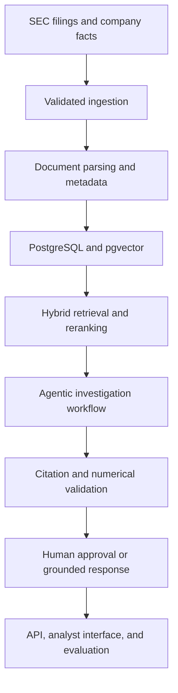

# FinSight AI

**Agentic financial-risk intelligence grounded in public SEC filings.**

FinSight AI is a production-oriented AI engineering project designed to help analysts investigate company risks, financial trends, and regulatory disclosures using evidence-backed answers.

The planned platform combines SEC document ingestion, hybrid retrieval, grounded generation, numerical validation, agent orchestration, human approval controls, evaluation, observability, and cloud deployment.

> FinSight AI is an independent educational project. It does not provide investment, legal, accounting, or financial advice.

## Project status

**Current milestone: Engineering foundation**

Implemented:

- Typed FastAPI application with health-check endpoint
- Environment-based configuration using Pydantic Settings
- Strict Ruff, mypy, pytest, and coverage configuration
- Docker Compose environment for PostgreSQL 17
- pgvector and PostgreSQL trigram-search extensions
- Python 3.12 project packaging and dependency groups
- Unit tests with 100% coverage for the current application layer

Planned next:

- SEC EDGAR filing and company-facts ingestion
- Metadata-aware document parsing and chunking
- PostgreSQL and pgvector persistence
- Hybrid semantic and keyword retrieval
- Reranking and citation-grounded generation
- LangGraph investigation workflow
- MCP-compatible financial-data tools
- Numerical verification and safety guardrails
- Retrieval and answer-quality evaluation
- Experiment tracking and A/B testing
- Analyst-facing application and AWS deployment

## Problem

Financial analysts review large filings containing risk disclosures, accounting notes, management commentary, and numerical tables. Traditional keyword search can locate matching words but does not reliably connect related evidence, validate calculations, or produce a traceable investigation.

FinSight AI is being built to support questions such as:

- What material risks changed between two reporting periods?
- Which filing passages support a stated financial trend?
- Are calculated growth rates consistent with reported company facts?
- What evidence supports or contradicts an investigation hypothesis?
- When should the system escalate an answer for human review?

## Target architecture



The diagram represents the target architecture. Components will be marked as implemented only after their code and tests are committed.

## Technology direction

| Area | Technology |
|---|---|
| API | FastAPI, Pydantic |
| Data source | SEC EDGAR public filings and company facts |
| Relational storage | PostgreSQL 17 |
| Vector search | pgvector |
| Keyword search | PostgreSQL full-text and trigram search |
| Retrieval | Hybrid retrieval, metadata filtering, reranking |
| Agent orchestration | LangGraph |
| Tool integration | Model Context Protocol |
| Evaluation | Retrieval, faithfulness, citation, numerical and latency metrics |
| Experimentation | Offline experiments and controlled A/B testing |
| Observability | Structured logs, traces, metrics and evaluation telemetry |
| Local infrastructure | Docker Compose |
| Cloud target | AWS with infrastructure as code |

Technology choices may evolve as the implementation is benchmarked. The repository will document architectural decisions and trade-offs rather than adding tools solely for breadth.

## Repository structure

```text
finsight-ai/
├── apps/
│   ├── api/
│   └── web/
├── docs/
├── evals/
├── infrastructure/
│   ├── postgres/
│   └── terraform/
├── src/finsight/
│   ├── agents/
│   ├── api/
│   ├── config/
│   ├── evaluation/
│   ├── experiments/
│   ├── guardrails/
│   ├── ingestion/
│   ├── mcp/
│   ├── models/
│   ├── observability/
│   ├── retrieval/
│   └── storage/
├── tests/
│   ├── integration/
│   ├── security/
│   └── unit/
├── docker-compose.yml
└── pyproject.toml
```

## Local setup

### Prerequisites

- Python 3.12
- Docker Desktop with Docker Compose
- Git
- Node.js 24 will be used when the web application is introduced

### Install the project

```bash
git clone https://github.com/GowthamKondabolu/finsight-ai.git
cd finsight-ai

python3.12 -m venv .venv
source .venv/bin/activate

python -m pip install --upgrade pip
pip install -e ".[dev]"
```

### Configure the environment

```bash
cp .env.example .env
```

Update `FINSIGHT_SEC_USER_AGENT` in `.env` with a valid application name and contact email before accessing SEC services.

Do not commit `.env` or production credentials.

### Start PostgreSQL

```bash
docker compose up -d postgres
docker compose ps
```

Confirm that the required extensions are installed:

```bash
docker compose exec -T postgres \
  psql -U finsight -d finsight \
  -c "SELECT extname, extversion FROM pg_extension WHERE extname IN ('vector', 'pg_trgm') ORDER BY extname;"
```

Stop the local services without deleting stored data:

```bash
docker compose down
```

### Run the API

```bash
uvicorn finsight.api.main:app --reload
```

Open:

- API health check: http://127.0.0.1:8000/health
- Interactive API documentation: http://127.0.0.1:8000/docs

## Quality checks

```bash
ruff format --check .
ruff check .
mypy src
pytest
git diff --check
```

The test suite enforces a minimum coverage threshold of 85%.

## Engineering principles

- Ground generated answers in attributable source evidence.
- Keep ingestion, retrieval, reasoning, validation, and presentation independently testable.
- Treat numerical claims as data-validation problems, not only language-generation tasks.
- Preserve filing, section, company, period, and source metadata throughout retrieval.
- Require human approval for high-risk or insufficiently supported conclusions.
- Evaluate retrieval and answer quality separately.
- Never present synthetic benchmarks as real-world financial performance.
- Keep secrets, credentials, and sensitive data outside the repository.

## Roadmap

1. Add database models, migrations, and repository abstractions.
2. Build compliant SEC filing and company-facts ingestion.
3. Implement parsing, metadata enrichment, and deterministic chunking.
4. Add hybrid retrieval, metadata filters, and reranking.
5. Build citation-grounded answer generation and numerical validation.
6. Add LangGraph orchestration, MCP tools, and human approval states.
7. Create retrieval, faithfulness, safety, and latency evaluations.
8. Add experiment tracking and controlled A/B testing.
9. Build the analyst-facing application.
10. Add observability, container deployment, Terraform, and AWS infrastructure.
11. Publish a reproducible benchmark, architecture case study, and live demonstration.

## Responsible use

FinSight AI is intended for education, engineering demonstration, and analyst decision support using public information. Outputs may be incomplete, outdated, or incorrect.

Users must verify every material conclusion against the original filing and consult appropriately qualified professionals before making financial, legal, regulatory, or investment decisions.

## Author

**Gowtham Kondabolu**

- [Portfolio](https://gowthamkondabolu.github.io/)
- [LinkedIn](https://www.linkedin.com/in/gowtham512/)