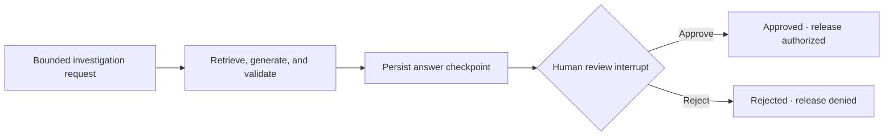

# Durable investigation workflow

FinSight wraps the citation-grounded Step 7 answer engine in a LangGraph state machine with PostgreSQL checkpoints and an explicit human-review interrupt. The graph does not replace retrieval, citation validation, or deterministic arithmetic; it controls when an already validated answer may be released.

## State transitions

Starting `POST /v1/investigations/runs` creates a thread, executes the existing guarded investigation once, and pauses with `status: pending_review` and `release_authorized: false`. The response includes a bounded review packet containing the proposed answer, answer status, source identifiers, limitations, and review reasons.

`POST /v1/investigations/runs/{thread_id}/review` accepts only `approve` or `reject`, an attributable reviewer identifier, and an optional note. The application adds a timezone-aware decision timestamp. Approval changes only the workflow release state; it does not rewrite citations, calculations, limitations, or the underlying answer status.

## Persistence contract

The PostgreSQL checkpointer stores JSON-compatible query, answer, decision, and status values under the caller-visible thread UUID. A resumed graph loads the pending interrupt and does not repeat retrieval, embedding, or model generation.

LangGraph manages its internal `checkpoints`, `checkpoint_blobs`, `checkpoint_writes`, and `checkpoint_migrations` tables through its versioned setup routine. Alembic deliberately excludes those external-library tables while continuing to detect drift in FinSight-owned tables.

The review node performs no side effects before calling `interrupt()`. LangGraph re-enters an interrupted node from its beginning during resume, so this ordering prevents duplicate external actions.

## Safety invariants

- Every generated financial answer pauses for qualified review.
- Only an `approved` terminal state sets `release_authorized` to true.
- Reviewers can approve or reject; they cannot inject edited answer text through the resume payload.
- Unknown thread IDs return 404; duplicate starts and terminal re-reviews return 409.
- Reviewer identity, decision, note, and timestamp are persisted with the graph state.
- Provider or grounding-contract failures occur before the review gate and cannot be approved.

## Verification

Unit tests cover pause/resume behavior, non-reexecution, approval and rejection, transition conflicts, review validation, API error mapping, and resource cleanup. A PostgreSQL integration test starts a run with one graph/checkpointer instance and resumes it through a fresh instance, modeling a process restart.

## Current limitations

- The API does not yet authenticate the asserted reviewer identity or enforce roles.
- Checkpoints preserve the latest workflow history but are not a separate immutable compliance ledger.
- PostgreSQL checkpointer setup currently runs when a production workflow context opens; deployment-lifespan initialization and pooled long-lived resources are planned.
- The stateless `/v1/investigations/answer` endpoint remains for compatibility and always marks its result as requiring review.
