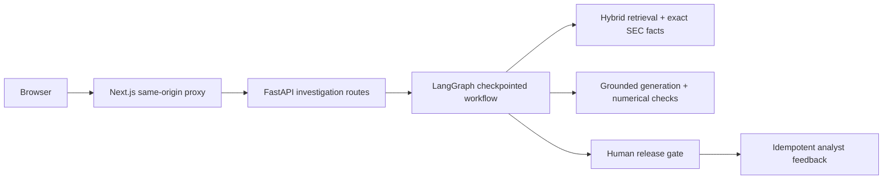

# Analyst-facing investigation workspace

FinSight includes a Next.js analyst workspace that turns the existing retrieval, answer-validation, and durable-review services into one evidence-first investigation flow. It is decision-support software over public SEC data; it does not provide investment, legal, accounting, or financial advice.

## Capabilities

- Filing Q&A with bounded SEC metadata filters
- Period-over-period risk comparison prompts
- Exact SEC company-fact verification
- Claim-to-source citations and filing provenance
- Deterministic numerical-validation results
- Model identity, limitations, and review reasons
- Durable thread restoration from PostgreSQL checkpoints
- Attributable approve-or-reject human review
- Idempotent post-review evidence-quality feedback
- A visibly labelled interface fixture that requires no model, API, or database

The fixture demonstrates rendering and interaction contracts only. It is not a generated answer, a benchmark result, or evidence of system performance.

## Architecture



The browser never receives provider keys, database credentials, the API bearer token, or the backend base URL. Next.js resolves `FINSIGHT_API_BASE_URL` and `FINSIGHT_API_AUTH_TOKEN` only on the server and forwards only these route shapes:

- `GET /health`
- `POST /v1/investigations/runs`
- `GET /v1/investigations/runs/{thread_id}`
- `POST /v1/investigations/runs/{thread_id}/review`
- `POST /v1/investigations/runs/{thread_id}/feedback`

The proxy rejects other paths, non-HTTP backend schemes, unsupported methods, and requests exceeding its bounded timeout. It supplies the deployment bearer token only on the server-to-server hop, returns JSON, and does not forward browser cookies or arbitrary headers to FastAPI.

## Run locally

From the repository root, prepare the Python environment, PostgreSQL, migrations, and SEC data as documented in the main README. Start FastAPI:

```bash
uvicorn finsight.api.main:app --reload
```

In another terminal:

```bash
npm ci --prefix apps/web
npm --prefix apps/web run dev
```

Open http://127.0.0.1:3000. The default proxy target is `http://127.0.0.1:8000`; override it only on the Next.js server:

```bash
FINSIGHT_API_BASE_URL=https://api.internal.example \
  npm --prefix apps/web run dev
```

## Live investigation requirements

A live run requires all of the following:

1. PostgreSQL and pgvector running with `alembic upgrade head` applied.
2. SEC filings ingested, parsed, chunked, and embedded for the selected issuer.
3. Company facts ingested when exact fact concepts are requested.
4. A valid `FINSIGHT_OPENAI_API_KEY` configured only for the FastAPI process.
5. FastAPI reachable from the Next.js server at `FINSIGHT_API_BASE_URL`.

Starting a run never authorizes release. The answer remains `pending_review` until an attributable reviewer approves or rejects that exact checkpoint. Feedback is accepted only after a terminal review decision.

## Feedback contract

Feedback uses a caller-generated idempotency key scoped to the workflow thread. An exact retry returns the existing record; reusing the key with different content returns a conflict. Stored fields are intentionally bounded:

- `helpful` or `not_helpful` rating
- evidence-quality score from 1 to 5
- up to four controlled issue tags
- optional 2,000-character comment

The API does not request investor identity, holdings, trading intent, or other financial profile data.

## Quality checks

```bash
npm --prefix apps/web run lint
npm --prefix apps/web run typecheck
npm --prefix apps/web test
npm --prefix apps/web run build
```

GitHub Actions runs these checks alongside Python formatting, typing, tests, migration validation, dependency auditing, and PostgreSQL integration tests.

## Limitations

- The workspace does not execute trades, modify SEC evidence, or perform unrestricted tool calls.
- Generated summaries may omit relevant context even when citations validate syntactically.
- A citation supports only the associated claim and must still be opened and checked by a qualified reviewer.
- Exact arithmetic checks do not establish accounting, legal, or investment correctness.
- The local interface fixture is static and must never be represented as live model output.
