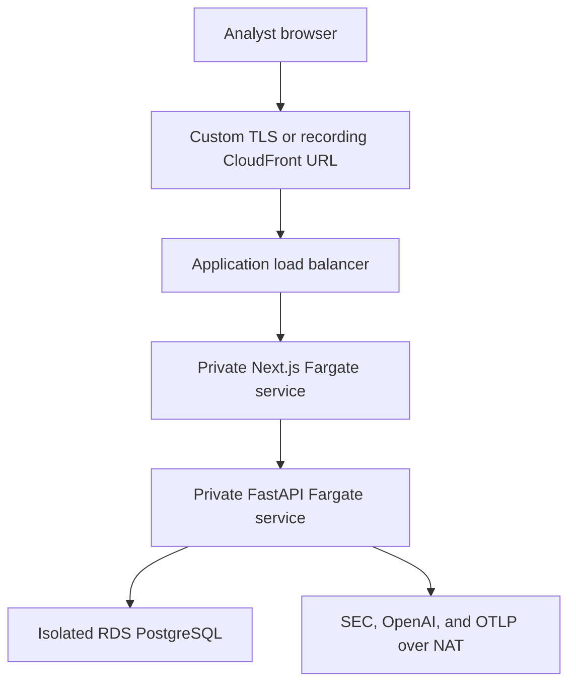

# AWS deployment architecture

FinSight's staging reference architecture deploys the hardened API and analyst application images from this repository without exposing FastAPI directly to the internet.

## Trust boundaries

- Standard staging uses the public ALB only to redirect HTTP to its ACM-backed HTTPS listener. Recording mode instead exposes an AWS-provided CloudFront HTTPS URL and restricts ALB port 80 to the AWS-managed CloudFront origin-facing prefix list.
- Web and API tasks have no public IP addresses. The server-side Next.js proxy reaches FastAPI through private Cloud Map DNS and supplies the bearer token from Secrets Manager.
- FastAPI accepts port 8000 only from the web security group. PostgreSQL accepts port 5432 only from the API security group.
- Database subnets have no internet route. Application subnets use NAT for SEC EDGAR, model-provider, ECR, CloudWatch, Secrets Manager, and optional OTLP access.
- Two time-bounded Trivy exceptions permit only outbound TCP 443 from the web and API tasks. Public SEC, model-provider, and OTLP endpoints do not provide stable destination CIDRs, while the cost-controlled staging stack intentionally omits paid interface endpoints. The exceptions expire on 2027-02-16 and must be reassessed before production promotion.
- ECS runtime roles have no AWS API permissions. The separate execution role can pull images, write logs, and read only named application secrets.
- RDS storage is encrypted, not public, backed up for seven days, and uses an RDS-managed rotating master secret.

## Deployment safety

The workflow is manual and bound to the protected GitHub `staging` Environment. It uses the repository's immutable OIDC subject, exact deploy and destroy confirmation phrases, remote state locking, immutable image tags, a migration-before-service sequence, ECS deployment circuit breakers, and service stability checks. Recording mode adds a verified teardown path for the primary hourly cost drivers.

Terraform validation runs for infrastructure pull requests without AWS credentials. The pipeline also scans Terraform for critical misconfigurations. Applying infrastructure is deliberately separate from merging code.

The protected Environment supplies the SEC identity at deployment time through `FINSIGHT_SEC_USER_AGENT`; no personal contact address is committed to Terraform defaults.

## Observability and rollback

ECS enhanced Container Insights, structured application logs, optional OTLP traces and metrics, RDS logs, CloudWatch alarms, and SNS alert routing support diagnosis. ECS circuit breakers automatically roll back failed service deployments.

For an operator rollback, rerun the deployment workflow from a known-good commit or update the services to known-good immutable task-definition revisions. Do not roll back database migrations until the migration's downgrade behavior and data impact have been reviewed.

## Current limitations

- The repository provides a staging implementation, not proof of a live public AWS deployment.
- Standard staging still expects externally managed DNS and ACM validation. Recording mode is temporary and uses the default CloudFront hostname rather than claiming a permanent production domain.
- The staging application currently shares the RDS master credential used by Alembic. Production requires separate migration and least-privilege application roles.
- Cross-region recovery, WAF, identity-aware user authentication, private AWS service endpoints, and budget automation are documented promotion decisions rather than unreviewed defaults.
- A generated answer remains decision support, not an autonomous financial action; the existing citation, numerical, abstention, and human-review controls still apply in AWS.

See [Terraform operations](../infrastructure/terraform/README.md), [Container deployment](container_deployment.md), [Production observability](observability.md), and the [Operations runbook](operations_runbook.md).

## Temporary evidence capture

The recording profile is designed for a short-lived, production-style staging validation. It is not a permanent live service and does not change the production promotion requirements above. Use the [AWS evidence-capture runbook](aws_evidence_capture.md) to prepare locally, capture only non-sensitive proof, destroy the environment, and publish an accurate deployment record.
